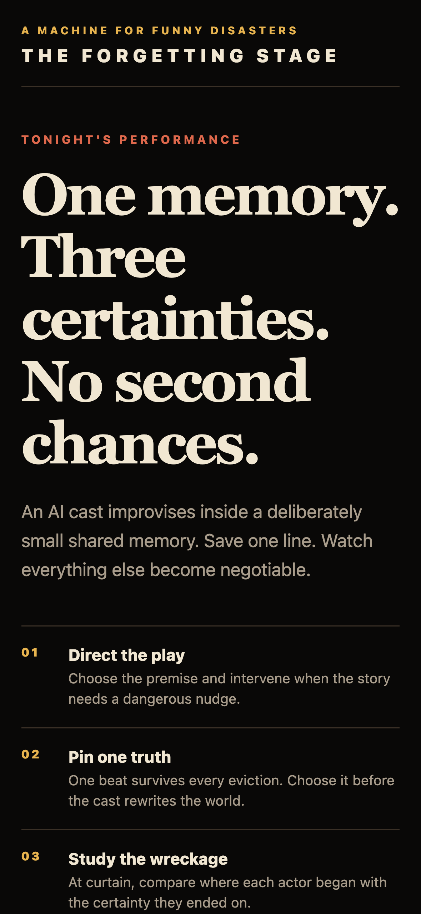

# The Forgetting Stage

**A story machine where an AI cast improvises a play inside a deliberately small shared memory,
and you choose the one thing they are allowed to keep.**

Successor to the original [Thousand-Token Theater repository](https://github.com/himanshu748/build-small-hackathon-thousand-token-theater) and [Hugging Face Space](https://huggingface.co/spaces/build-small-hackathon/thousand-token-theater), which won the Build Small Hackathon. Entry for RevenueCat Shipaton 2026.

The cast shares a bounded memory. As the play runs the oldest beats fall out, and the
next two actors receive the same structured probe about a genuinely erased seed. Each
supplies a visible, confident replacement, and the stage groups both answers with the
lost fact so the contradiction has a clear cause. You get one pin. The comedy is the
contrast: one fact stubbornly survives while everything around it rots.

There is no goal and no way to lose. It is a machine for producing funny disasters, and
the player composes rather than competes.

## Play it

The repository now includes a mobile-first Expo game with premise selection, a live AI stage, the final drift report and a RevenueCat-powered Director's Pass. One complete AI performance is free per local calendar day and refreshes at midnight; the `directors_pass` entitlement unlocks unlimited performances. If live generation is unavailable, the current turn falls back to a deterministic performance without breaking the game.



This is current **web-build evidence** of the real lobby, captured at a 393 by 852 CSS-pixel viewport with a device scale factor of 3, producing a 1179 by 2556 PNG. It is not the official target-device submission screenshot. Follow the device evidence checklist in [docs/submission/device-validation.md](docs/submission/device-validation.md) before submitting.

```bash
npm install
npm start
```

Use `npm run ios`, `npm run android` or `npm run web` for a specific platform. During a play you can pin exactly one actor line, spend one director note, watch shared memory evict its oldest facts and compare each actor's first and final certainty at curtain.

### Android native workflow

This repository intentionally commits `android/` because the development client and sponsor SDKs contain native code. Expo Go is not a valid test environment for RevenueCat, Layers or OneSignal. Use `npx expo run:android` or the checked-in Gradle project for a local development build.

When a native directory is committed, EAS does not copy native-facing `app.json` fields into it. The Android project is therefore the build source of truth. Its package ID, version, portrait orientation, dark launch background, adaptive icon, deep-link scheme and plugin resources are maintained alongside `app.json`. The corresponding Expo Doctor sync warning is disabled in `package.json` for this deliberate workflow, not because those fields are ignored.

```bash
npx expo install --check
npx expo-modules-autolinking verify --platform android
npx expo run:android
```

The observed local API 36 build and emulator preflight are recorded separately from physical-device submission evidence in [docs/submission/device-validation.md](docs/submission/device-validation.md). EAS builds must only be started after confirming they will consume no paid minutes.

## Live AI gateway

The mobile client calls the narrow `POST /api/generate` action contract. It may ask to start, advance, pin, direct or finish. It cannot send a transcript, choose a speaker or restore an erased fact. The server creates the performance, owns every canonical beat and builds each model prompt exclusively from the post-eviction server snapshot.

Live memory uses the tokenizer for the same model ID sent to Hugging Face. The zero-dependency `@huggingface/tokenizers` package counts text with special tokens disabled, matching the original Thousand-Token Theater method. All unpinned shared memory is capped at exactly 1,000 model tokens. The one pinned actor line lives outside that allowance and never evicts. A normal live play is ten rounds, or thirty actor beats. The curtain stays locked until at least one erased seed receives two distinct confident replacements. Exceptionally short output can add at most two recovery rounds, then the app surfaces an honest retry state instead of claiming that forgetting occurred.

The gateway caps request bodies, applies a provider timeout, rejects transcript or speaker fields and returns safe errors. It uses a 40-request-per-minute shared capacity bucket per server process, enough for one complete play plus its state-only actions, and never trusts caller-supplied forwarding headers as identity. `HF_TOKEN` remains server-only.

The checked-in session store and rate limiter are process-local. They are suitable for a single persistent preview process, but not a horizontally scaled production deployment where requests can reach different instances. Before public production exposure, replace both with a durable shared store and quota or a server-verifiable signed performance state. Set a hard provider spending limit too. This repository does not claim those deployment controls are configured.

```bash
HF_TOKEN=hf_xxx MODEL=Qwen/Qwen3-4B-Instruct-2507 npx vercel dev
```

Run `api/generate.ts` in one persistent preview process or adapt its store to durable shared storage before using a serverless fleet. Web can use its same-origin `/api/generate` route. iOS and Android require an absolute HTTPS URL for the deployed gateway:

```bash
EXPO_PUBLIC_GENERATION_ENDPOINT=https://api.example.com/api/generate
```

Never prefix `HF_TOKEN` with `EXPO_PUBLIC_`.

## RevenueCat and the daily curtain

Install and configure a RevenueCat project with:

- Entitlement: `directors_pass`
- Offering: a current offering containing the Director's Pass package
- A Test Store product for development, then platform products before store release

The app checks, purchases and restores the entitlement through `react-native-purchases`. Test Store use requires an explicit preview flag, so a leftover test key cannot silently override a platform key:

```bash
EXPO_PUBLIC_REVENUECAT_USE_TEST_STORE=true
EXPO_PUBLIC_REVENUECAT_TEST_API_KEY=test_xxx
# Release builds instead use:
EXPO_PUBLIC_REVENUECAT_USE_TEST_STORE=false
EXPO_PUBLIC_REVENUECAT_IOS_API_KEY=appl_xxx
EXPO_PUBLIC_REVENUECAT_ANDROID_API_KEY=goog_xxx
```

These are RevenueCat public SDK keys intended for the app bundle, not secret RevenueCat API keys. Never put a secret API key in an `EXPO_PUBLIC_` variable. Production should omit the Test Store key as an additional safeguard.

The one-free-performance ledger is stored locally and resets on the next local calendar day. Director's Pass holders bypass the ledger. RevenueCat's Test Store can simulate success, failure and cancellation, but real native purchase testing requires an Expo development build rather than ordinary Expo Go. Never ship a Test Store API key in a production build.

## Retention and growth loop

The native app contains two optional sponsor integrations. Neither changes the core play when it is unconfigured.

- OneSignal asks for notification permission only after the player taps the reminder at curtain. A successful opt-in tags the daily-curtain audience and the last premise. The dashboard must still deploy at least one real campaign before the OneSignal track is eligible.
- Layers records performance starts, genuine seed eviction, curtain completion, reminder opt-in and box-office events. The `curtain_reminder_copy` feature flag supports a focused `free_show` versus `curiosity` copy experiment. The SDK does not request App Tracking Transparency on launch. A real App ID, verified native events and an observed experiment result are still required before claiming the Layers track.

```bash
EXPO_PUBLIC_ONESIGNAL_APP_ID=your-public-app-id
EXPO_PUBLIC_LAYERS_APP_ID=your-public-app-id
```

The evidence and eligibility gates for every prize target are tracked in [docs/submission/track-strategy.md](docs/submission/track-strategy.md).

## Engine and experiments

The deterministic test suite needs no API key. Live spikes, plays and experiments use Hugging Face Inference.

```bash
npm test
```

Proves the configured memory cap, pin mechanic, server-owned action contract and two-response probe chain with no network. Production loads the exact serving-model tokenizer. The offline preview uses an explicit approximation and labels its meter `EST. TOKENS` instead of pretending it is exact.

```bash
HF_TOKEN=hf_xxx npm run spike
```

The go/no-go check described below. Optionally set `MODEL` to compare candidates.

```bash
HF_TOKEN=hf_xxx npm run experiment
```

Runs a matched backend experiment with two arms: the configured bounded memory and a control where eviction is effectively disabled. Both arms use the same premise, cast, rounds and completion contract. The command prints a comparison report and writes structured JSON to `artifacts/latest-experiment.json`.

Configure it with `ROUNDS`, `BUDGET`, `CONTROL_BUDGET`, `PREMISE`, `MODEL` and `OUTPUT`. Experiment artifacts are local and ignored by Git.

The result records the first eviction round, forgotten beats, forgotten seeds, final memory size, per-character drift and whether the control remained intact. A causal signal of `isolated` means eviction occurred only in the forgetting arm. It does not claim semantic drift by itself. Review the paired transcripts or add a semantic scorer before making that stronger claim.

## The one thing that decides whether this works

After a fact is evicted, **two actors must invent different replacements for it**. If
they agree, there is no comedy. If either admits it forgot, the illusion breaks.

`npm run spike` tests exactly that and prints PASS or FAIL. Run it before building any
UI. Everything else in this project is downstream of that result.

The mechanism is one prompt in [`src/engine/prompts.ts`](src/engine/prompts.ts).
Thousand-Token Theater told actors *"never contradict the script"* and to be
*"intrigued by the gaps"*, which produced graceful degradation. This inverts it: actors
must invent specific, confident replacements and never acknowledge a gap.

## Layout

```
src/engine/types.ts        Beat, Character, budget constants
src/engine/prompts.ts      The inverted confabulation prompt, registers, curtain
src/engine/theater.ts      Ported engine: memory, eviction, pins, drift
App.tsx                    Expo game: lobby, live stage and drift report
src/game/content.ts        Premises, cast and deterministic demo performances
src/game/session.ts        Frontend game loop around the pure engine
src/game/performance.ts    Live generation provider with offline fallback
src/live/gateway.ts        Server-owned performance loop, validation and model calls
src/live/tokenizer.ts      Exact serving-model token counter
src/live/performance-store.ts  Preview performance state and expiry
src/monetization/           Daily refresh ledger and RevenueCat adapter
src/engagement/onesignal.ts Opt-in daily curtain reminder
src/analytics/layers.ts    Growth events and curtain-copy experiment
api/generate.ts            HTTP live-generation entry point
src/engine/theater.test.ts Proof the cap and pins are real
src/experiments/matched.ts Reusable forgetting vs control orchestration
src/experiments/run.ts      Live experiment CLI and JSON artifact writer
src/spikes/confabulation.ts Go/no-go check
```

Ported from the original `theater.py`, keeping its best decision: no model, no network
and no UI inside the engine. Changes: beats can be pinned and pinned beats never evict,
the prompt is inverted, a play ends on a curtain line rather than running out of turns,
and drift is derived from beat attribution so it needs no extra model call.

## Status

The native Expo game, pure memory engine, matched experiment backend, server-authoritative live-generation loop, exact serving-model tokenizer, daily free curtain, RevenueCat adapter, OneSignal reminder and Layers experiment hook are implemented. Local Android API 36 debug and release-mode builds pass, and an emulator fresh-install preflight reaches the honestly labeled offline performance. Unit and integration tests do not prove external dashboards, live model inference or a physical-device run. Submission still requires a real RevenueCat project and product, an observed Test Store purchase and restore, a deployed persistent generation endpoint, OneSignal and Layers App IDs, native build evidence, student proof for Next Gen and the required public video.

## Licence

MIT, see [LICENSE](LICENSE).
